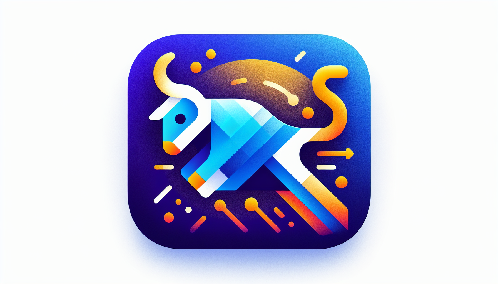

<div id="top">

<!-- HEADER STYLE: CLASSIC -->
<div align="center">



# STREAMLIT_IBOVESPA_2010-2024_EVOLUTION

<em>Empowering Visual Insights, Transforming Market Understanding</em>

<!-- BADGES -->


<em>Built with the tools and technologies:</em>


</div>
<br>

---

## 📄 Table of Contents

- [Overview](#-overview)
- [Getting Started](#-getting-started)
    - [Prerequisites](#-prerequisites)
    - [Installation](#-installation)
    - [Usage](#-usage)
    - [Testing](#-testing)

---

## ✨ Overview

Streamlit_Ibovespa_2010-2024_Evolution is a powerful developer tool that provides an interactive dashboard for visualizing the historical stock prices of Ibovespa companies from 2010 to 2024. Built with Streamlit, it enables dynamic filtering and clear visualizations, making complex financial data accessible and insightful.

**Why Streamlit_Ibovespa_2010-2024_Evolution?**

This project simplifies financial data exploration with features including:

- 🖥️ **Interactive Visualizations:** Dynamic line charts that update based on selected stocks and date ranges.
- 🎨 **Customizable Themes:** Easy-to-adjust visual styles, including a cohesive dark mode, for a polished user experience.
- 🔍 **Data Filtering:** Intuitive filters for tailored analysis of specific stocks or periods.
- ⚙️ **Seamless Configuration:** Clear setup instructions and environment customization to fit your workflow.
- 📊 **Insightful Analysis:** Facilitates quick understanding of market trends and stock evolution over years.
- 🚀 **Open-Source Flexibility:** Easily extend or adapt the dashboard to suit your analytical needs.

---

## 🚀 Getting Started

### 📋 Prerequisites

This project requires the following dependencies:

- **Programming Language:** Python
- **Package Manager:** Conda

### ⚙️ Installation

Build Streamlit_Ibovespa_2010-2024_Evolution from the source and install dependencies:

1. **Clone the repository:**

    ```sh
    ❯ git clone https://github.com/FrontendBackendFaculdade/Streamlit_Ibovespa_2010-2024_Evolution
    ```

2. **Navigate to the project directory:**

    ```sh
    ❯ cd Streamlit_Ibovespa_2010-2024_Evolution
    ```

3. **Install the dependencies:**

**Using [conda](https://docs.conda.io/):**

```sh
❯ conda env create -f conda.yml
```

### 💻 Usage

Run the project with:

**Using [conda](https://docs.conda.io/):**

```sh
conda activate {venv}
python {entrypoint}
```

### 🧪 Testing

Streamlit_ibovespa_2010-2024_evolution uses the {__test_framework__} test framework. Run the test suite with:

**Using [conda](https://docs.conda.io/):**

```sh
conda activate {venv}
pytest
```

---

<div align="left"><a href="#top">⬆ Return</a></div>

---
